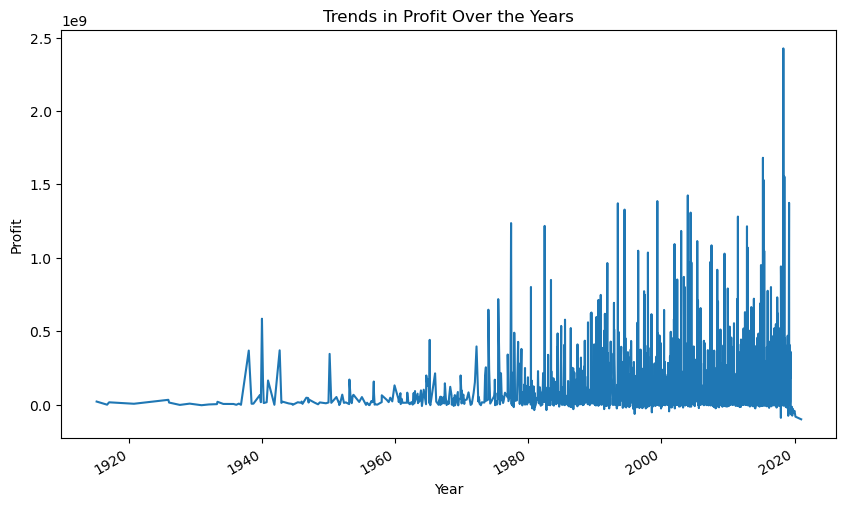
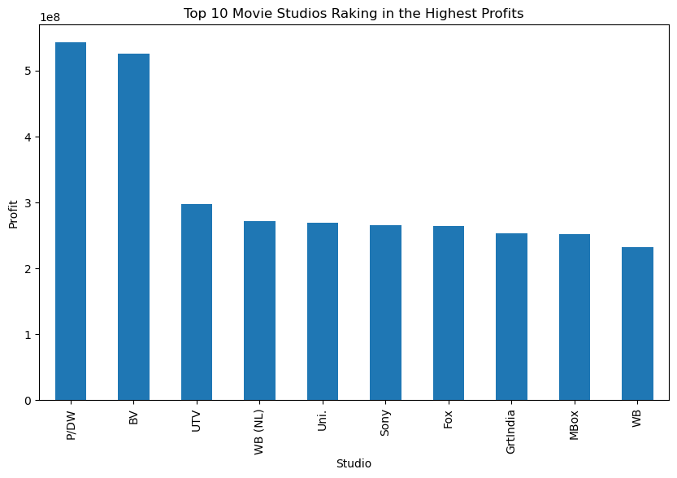

# Project Name: Data-Driven Decision Making: Empowering Microsoft's Movie Studio Venture

## Overview
This project aims to provide data-driven insights to Microsoft's movie studio venture. The analysis is based on a dataset of movie-related information, including data on movie titles, genres, ratings, and revenue. The project seeks to answer key business questions and provide recommendations to Microsoft on how to maximize the success of its movie studio venture.

## Business Understanding

## Introduction
In a bid to diversify its portfolio and tap into the entertainment industry, Microsoft has embarked on a new venture to create a new movie studio. However, due to the lack of expertise in the realm of film production, Microsoft seeks to leverage data-driven insights from successful films at the box office. As a data analyst, I have been tasked with analyzing the movie industry data to provide actionable insights that will help Microsoft make informed decisions on the types of movies to produce.

## Business Problem
Microsoft sees the potential of the creating original video content and has decided to create a new movie studio. However, they lack the expertise in the film industry and are looking for data-driven insights to help them make informed decisions on the types of movies to produce. The goal of this analysis is to provide actionable insights that will help Microsoft maximize their return on investment and increase their chances of success in the movie industry.

## Objectives
The objectives of this analysis are to:
- Identify the most successful genres at the box office.
- Determine the most successful months for movie releases.
- Identify the most successful production companies.
- Determine the relationship between movie budgets and box office revenue.
- Determine the relationship between production companies and box office revenue.
- Determine the relationship between release months and box office revenue.

## Business Value
The insights from this analysis will help Microsoft make informed decisions on the types of movies to produce, the best time to release movies, the best directors and actors to work with, and the best production companies to partner with. This will help Microsoft maximize their return on investment and increase their chances of success in the movie industry.

### Stakeholder
The primary stakeholder for this project is Microsoft, which is looking to enter the movie industry and create a new movie studio. 

### Key Business Questions

1. What are the most successful genres at the box office?
2. What are the most successful months for movie releases?
3. What are the most successful production companies?
4. What is the relationship between movie budgets and box office revenue?
5. What is the relationship between production companies and box office revenue?
6. What is the relationship between release months and box office revenue?

## Data Understanding and Analysis

### Source of Data
1. https://www.boxofficemojo.com/
2. https://www.imdb.com/
3. https://www.rottentomatoes.com/
4. https://www.themoviedb.org/
5. https://www.the-numbers.com/

### Description of Data

The project utilizes multiple datasets sourced from various sources within the movie industry. Each dataset provides unique insights into different aspects of the movie landscape, including box office performance, genre trends, release patterns, and studio profitability. Here's an overview of the datasets used:
1. Box Office Mojo Dataset
    Structure: This dataset contains information on movie titles, studios, domestic gross revenue, foreign gross revenue, and release years.
    Relevant Details: The dataset helps analyze the financial performance of movies at the box office, including revenue distribution, trends over time, and the impact of studios on movie profitability.

2. The Numbers Dataset
    Structure: This dataset includes details on movie titles, release dates, production budgets, domestic gross revenue, worldwide gross revenue, total gross revenue, and profitability.
    Relevant Details: The dataset facilitates analysis of movie economics, including production costs, revenue generation, profitability trends, and correlations between financial metrics.

3. Rotten Tomatoes Movie Dataset
    Structure: This dataset provides information on movie IDs, synopses, ratings, genres, directors, writers, theater release dates, DVD release dates, currency, box office revenue, runtime, and studios.
    Relevant Details: The dataset enables analysis of movie genres, critical ratings, release strategies, and studio affiliations, offering insights into audience preferences and industry trends.

4. Rotten Tomatoes Reviews Dataset
    Structure: This dataset contains movie IDs, reviews, ratings, freshness indicators, critics' details, and publication dates.
    Relevant Details: The dataset facilitates sentiment analysis, critical reception evaluation, and reviewer insights, contributing to understanding audience reactions and movie reception.

5. IMDB Database (Not Directly Used)
    Structure: The IMDB database comprises multiple tables, including movie basics, directors, known for, movie AKAs, movie ratings, persons, principals, and writers.
    Relevant Details: While not directly utilized, the IMDB database could potentially offer additional information on movie attributes, crew details, and industry connections for further analysis and enrichment.

Each dataset was meticulously cleaned, preprocessed, and analyzed to extract meaningful insights into different aspects of the movie industry. By leveraging these diverse datasets, the project provides comprehensive analyses and recommendations for strategic decision-making in the movie studio venture.

### Visualizations

Include three visualizations that were presented in the slides and notebook. Provide a brief description for each visualization.
a. Visualization 1: Trend in Profit Over Years

This visualization shows the trend in profit over the years. It indicates the profitability of movies over time and helps identify any patterns or trends in movie profitability.

b. Visualization 2: Production Budget vs. Profit

This visualization shows the relationship between production budgets and profits. It helps identify the impact of production budgets on movie profitability and provides insights into the cost-effectiveness of movie production.

c.Visualization 3: Top 10 Movie Studios Raking in the Highest Profits

This visualization shows the top 10 movie studios raking in the highest profits. It helps identify the most successful movie studios in terms of profitability and provides insights into the competitive landscape of the movie industry.

## Conclusion
Key Findings:

1. Box Office Performance Trends:
    The analysis reveals that domestic, worldwide, and total gross revenues demonstrate right-skewed distributions with considerable variability. Despite fluctuations, there is a notable upward trend in revenues from 2010 to 2018, peaking in 2018. This indicates the industry's overall growth and potential for revenue generation.

2. Genre Preferences and Audience Engagement:
    Drama, comedy, and action emerge as the most prevalent genres, while documentary exhibits minimal representation. Understanding these genre preferences provides valuable insights for content creation strategies, allowing Microsoft to tailor its productions to align with audience interests and maximize engagement.

3. Release Date Dynamics and Industry Competitiveness:
    December emerges as the month with the highest number of movie releases, followed by October, August, and September. Moreover, the consistent increase in movie releases over the years reflects the industry's competitiveness and growth trajectory. By strategically timing releases and leveraging insights into release date dynamics, Microsoft can optimize audience reach and box office performance for its movie productions.

These findings underscore the importance of data-driven decision-making in navigating the complexities of the movie industry, enabling Microsoft's movie studio venture to capitalize on emerging trends, audience preferences, and industry dynamics for sustainable success.
